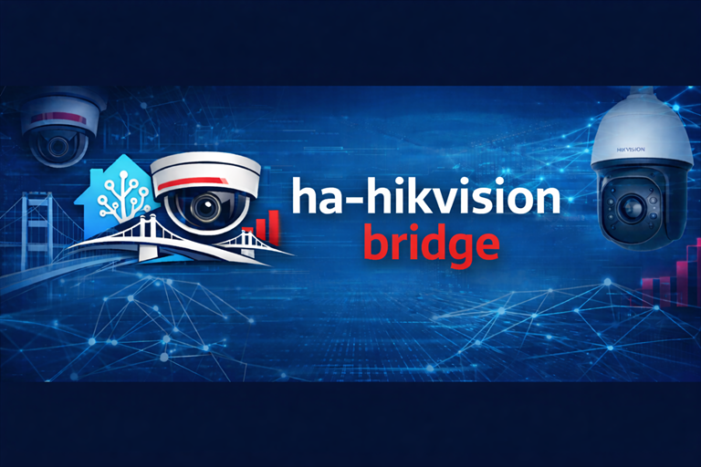

<p align="center">
  
</p>

<h1 align="center">ha-hikvision-bridge</h1>
<p align="center"><strong>Local-first Hikvision integration for Home Assistant</strong></p>
<p align="center">Control • State • Stream orchestration • Playback session lookup</p>

<p align="center">
  <a href="https://github.com/skstussy/ha-hikvision-bridge/releases"></a>
  <a href="https://github.com/skstussy/ha-hikvision-bridge"></a>
  <a href="https://www.hacs.xyz/"></a>
  
</p>

<p align="center">
  <a href="https://github.com/skstussy/ha-hikvision-bridge/issues">Report Bug</a> •
  <a href="https://github.com/skstussy/ha-hikvision-bridge/issues">Request Feature</a> •
  <a href="#documentation">Documentation</a>
</p>

---

## Overview

`ha-hikvision-bridge` is a **backend integration** for Home Assistant that talks to Hikvision devices over **ISAPI** and exposes camera control, device state, alarms, storage details, and playback lookup features inside Home Assistant.

At its core, this project is a:

- **control layer** for PTZ, presets, zoom, focus, iris, and stream selection
- **state layer** for sensors, binary sensors, storage information, and alarm visibility
- **stream orchestration layer** for RTSP/WebRTC-related state and playback session handoff

It is **not** a video processing engine, NVR replacement, or cloud service.

---

## What this integration does well

### PTZ and lens control
- Pan / tilt movement through Home Assistant services
- Preset recall
- Zoom control
- Focus control
- Iris control
- Return-to-home correction flow using tracked relative state supplied by the frontend or automation

### Camera and NVR state visibility
- Camera info sensors
- Camera stream info sensors
- NVR system info sensor
- NVR storage info sensor
- Per-disk HDD sensors
- Camera online / PTZ-supported / alarm binary sensors
- NVR online / alarm-stream / disk health binary sensors
- Alarm input binary sensors

### Live stream orchestration
- Stream mode selection by entity
- Stream profile selection by entity
- RTSP and direct RTSP URL handling in entity attributes
- WebRTC URL signing via Home Assistant websocket commands

### Playback lookup
- Searches recordings through `POST /ISAPI/ContentMgmt/search`
- Retrieves a `playbackURI` for the requested timestamp window
- Starts playback state on the camera entity
- Stops playback and returns the entity to live-view state

---

## Honest limitations

These are current implementation realities, not marketing copy:

- Playback currently forces **main-stream track mapping** (`101`, `201`, `301`, etc.)
- Channel handling includes **hardcoded assumptions** in parts of the backend
- Recording searches are performed per request; there is **no recording index cache**
- The integration depends on **Hikvision firmware behavior** and XML shape consistency
- The active ISAPI client path uses **Basic Auth**
- WebRTC depends on your broader Home Assistant / go2rtc setup; this integration signs and supplies URLs, but it does not render or transcode video itself

---

## Why this project exists

A lot of Hikvision setups look straightforward on paper and turn out messy in real use.

Common problems include:

- PTZ capability reports that do not match real device behavior
- DVR/NVR proxy routing that behaves differently from direct camera endpoints
- differences between main stream, sub-stream, RTSP, and playback paths
- event and alarm endpoints that work on one device family but not another

This integration is built around **observed working behavior on real hardware**, not just idealized API assumptions.

---

## Architecture at a glance

```text
Home Assistant
   ↓
Coordinator (polling + event ingestion + shared state)
   ↓
Controller / ISAPI client
   ↓
Hikvision device
```

For browser-based live viewing, the backend also exposes websocket helpers for signed URLs and debug streaming:

```text
Frontend / dashboard
   ↓
Home Assistant websocket API
   ↓
Signed stream URL / debug events
```

---

## Services

### PTZ and optical control
- `ha_hikvision_bridge.ptz`
- `ha_hikvision_bridge.goto_preset`
- `ha_hikvision_bridge.zoom`
- `ha_hikvision_bridge.focus`
- `ha_hikvision_bridge.iris`
- `ha_hikvision_bridge.ptz_return_to_center`

### Stream and playback control
- `ha_hikvision_bridge.set_stream_mode`
- `ha_hikvision_bridge.set_stream_profile`
- `ha_hikvision_bridge.playback_seek`
- `ha_hikvision_bridge.playback_stop`

A legacy service namespace is also registered for compatibility with older installs.

---

## Installation

### HACS
1. Open **HACS**
2. Go to **Integrations**
3. Add this repository as a custom repository
4. Select category **Integration**
5. Install
6. Restart Home Assistant
7. Add the integration from **Settings → Devices & Services**

### Manual
1. Copy `custom_components/ha_hikvision_bridge` into your Home Assistant config directory
2. Restart Home Assistant
3. Add the integration from **Settings → Devices & Services**

---

## Configuration

The config flow expects:

- host
- port
- username
- password
- HTTPS preference
- SSL verification preference

Once configured, the coordinator performs an initial refresh and starts the alarm stream worker.

---

## Documentation

Full documentation lives in `/docs` and is organized as follows:

- `docs/index.md` — documentation home
- `docs/installation.md` — setup and prerequisites
- `docs/configuration.md` — config flow and assumptions
- `docs/streaming.md` — live-stream orchestration
- `docs/playback.md` — recording lookup behavior
- `docs/ptz.md` — PTZ and lens control
- `docs/services.md` — service reference
- `docs/entities.md` — entity reference
- `docs/troubleshooting.md` — fault isolation guide
- `docs/architecture.md` — backend design overview

---

## Screenshots to add

Place these files into `docs/images/` when ready:

- `setup-config-flow.png` — Home Assistant config flow with secrets masked
- `device-overview-entities.png` — device page showing created entities
- `camera-live-view.png` — live-view example using your frontend/card
- `stream-mode-section.png` — stream mode and profile display
- `playback-active-session.png` — playback running from a selected timestamp
- `ptz-controls-panel.png` — PTZ controls shown in the dashboard
- `storage-sensors-overview.png` — storage and HDD entities visible
- `alarm-dashboard-overview.png` — alarm-related entities or dashboard section
- `debug-dashboard-events.png` — debug event feed shown in the UI

---

## Built with GenAI

This project was developed through heavy **GenAI-assisted iteration**.

That is part of the story here, but the important part is not the novelty. The important part is that the repository has been pushed through repeated real-world testing, debugging, and correction cycles to match how Hikvision systems actually behave.

---

## Support

If you want to support the project:

[](https://ko-fi.com/skstussy43571)
[](https://www.paypal.com/donate/?hosted_button_id=G2PU9CH6A53HU)

---

## Final note

This integration already covers a useful and fairly deep backend surface area. It is also still evolving. The docs in this repo are written to reflect the **current implementation truthfully**, including what is solid, what is conditional, and what still has hard edges.
